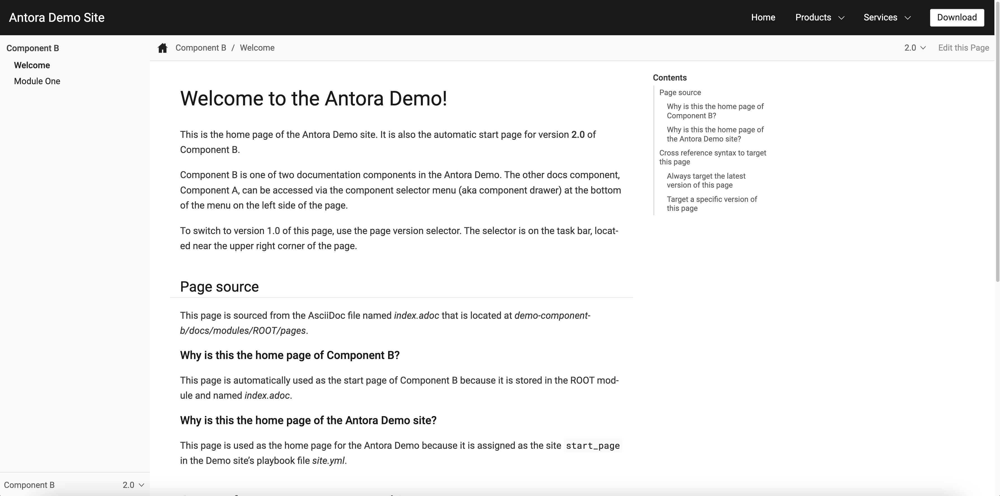

= 정리용도 간단한 블로그 생성 가이드 (with asciidoc)

== 개요
ASCIIDOC 을 익히고 앞으로 해당 문법을 사용해서 컨텐츠를 정리하기 위해 블로그를 간단하게 만들었다. +

.Asciidoc 지원 프레임워크 
* https://gist.github.com/briandominick/e5754cc8438dd9503d936ef65fffbb2d[]

이중에서 흥미가 생겼던 Antora 를 통해서 간단히 구축했다. 생성방법은 어렵지 않았다

.Antora-Starter(참고)
* https://docs.antora.org/antora/latest/install-and-run-quickstart/[]

가이드 대로 따라한다면 다음과 같은 사이트를 만들어 낼 것이다.
 

로컬에서 `npx antora antora-playbook.yml` 를 통해 빌드가 되므로 이를 액션으로 감지하여 빌드하도록 했다.

== 블로그 빌드
[source,yaml]
site:
  title: jeon3029 wiki
  start_page: TJ-TIL::first.adoc 
content:
  sources:
  - url: https://github.com/jeon3029/bloc-contents
  # 원격 레포로부터 컨텐츠를 끌어와 빌드한다
    branches: HEAD
ui: 
  bundle:
    url: ./ui-bundle
    snapshot: true

.publish.yml
[source,yml]
name: Publish to GitHub Pages
on:
  push:
    branches: [main]
jobs:
  build:
    runs-on: ubuntu-latest
    steps:
    - name: Checkout repository
      uses: actions/checkout@v2
    - name: Install Node.js
      uses: actions/setup-node@v2
      with:
        node-version: '16'
    - name: Install Antora
      run: npm i antora
    - name: Generate Site
      run: npx antora antora-playbook.yml
      # 블로그 빌드액션
    - name: Publish to GitHub Pages
      uses: peaceiris/actions-gh-pages@v3
      with:
        github_token: ${{ secrets.GITHUB_TOKEN }}
        publish_dir: build/site
        # buile/site 를 gh-pages 에 배포

같은 레포에 branch 를 나누어 메인 브랜치에서는 컨텐츠를 관리하고 gh-pages 로 빌드하여 빌드 컨텐츠를 분리하였다.

== Reference
* Asciidoc 기본 문법
** https://narusas.github.io/2018/03/21/Asciidoc-basic.html[]
