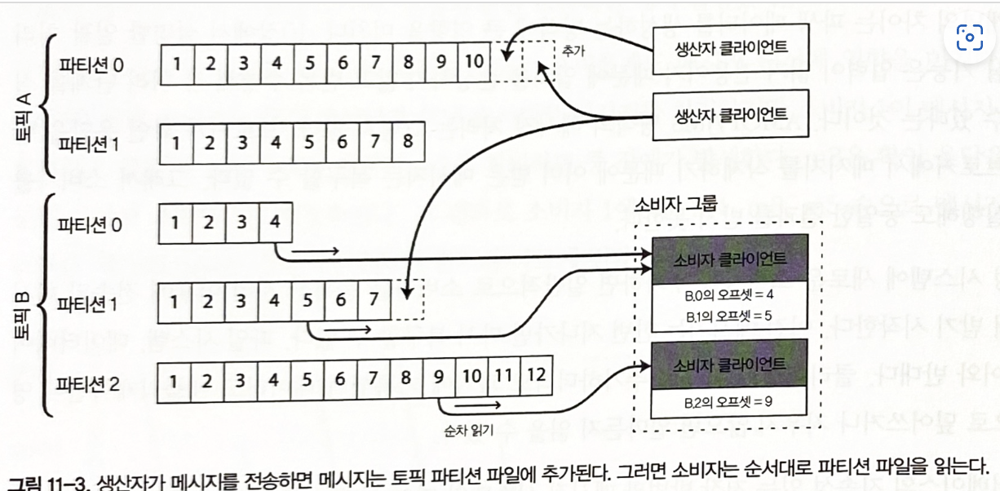

= 스트림 처리

== 용어 정리

.스트림
시간 흐름에 따라 점진적으로 생산된 데이터

.스트림 처리
일괄 처리와 다르게, 단순히 이벤트가 발생할 때마다 처리

.이벤트 스트림
점진적인 처리, 시간별로 정렬된 일련의 비즈니스 이벤트

.이벤트 예시
* 웹페이지를 보거나 상품을 구입하는 일
* 온도 센서 주기적으로 측정한 값
-> 특정 시점에 일어난 세부사항을 포함하는 작고 독립된 불변 객체

. 생산자(producer), 발생자(pubisher), 발송자(sender)는 이벤트를 만듦
. 소비자(consumer), 구독자(subscriber), 수신자(recipient)는 이벤트를 처리
. 스트림 시스템에서는 토픽(topic)이나 스트림으로 관련 이벤트를 묶음

메시징 시스템 두가지 케이스

 (1) 생산자의 메시지 생성 속도 > 소비자의 메시지 소비 속도"와 같은 상황
====
1. 시스템은 메시지를 버린다.
2. 큐에 메시지를 버퍼링한다.
3. 배압(Backpressure, 흐름 제어)처리를 한다. 
  (= 생산자가 메시지를 더는 보내지 못하게 막는다.)
====

 (2) 노드가 죽거나 일시적으로 오프라인이 된다면 어떻게 될까?
====
DB를 사용할 때처럼 지속성을 갖추려면 디스크에 기록하거나 복제본을 생성하거나 둘 모두를 해야 한다.

-> 메세지를 잃어도 괜찮다면 처리량높이고 지연시간 낮출 수 있다.
====

== 메세지 브로커

많은 메시지 시스템은 생산자 -> 소비자에게 직접 메시지를 전달한다.

* 메시지 유실 가능성이 크다.
* 소비자가 오프라인 상태라면 메시지를 전달받지 못하게 된다.
* 메시지 브로커는 서버로 구동되고 생산자와 소비자는 서버의 클라이언트로 접속하여 메시지를 읽게 된다

=== 메세지 브로커 vs DB

.생명주기
----
DB는 명시적으로 데이터 삭제 요청이 있기 전까지 데이터를 보관한다.
반면 메시지 브로커 대부분은 소비자에게 데이터 전송이 성공할 경우 자동으로 삭제한다.
그러므로 오랜 기간 데이터를 저장하는 용도로 메시지 브로커의 사용은 적절하지 않다.
----

.작업 용량
----
메시지 브로커는 대부분 메시지를 빨리 지우므로 작업 용량이 상당히 작다.
즉 큐 크기가 작다.
----

.색인지원
----
DB 는 색인을 지원하고, 검색을 위한 다양한 방법을 제시. 메시지 브로커는 토픽 기준으로 부분집합을 구독한다.
----

.데이터 변화
----
DB는 요청 시점의 스냅 샷을 기준으로 데이터를 반환한다.
메시지 브로커는 데이터가 변하면 클라이언트에게 새로운 메시지가 생겼다는 알림을 줄 수 있다.
----

=== 복수 소비자

.로드 밸런싱
* 메시지 브로커는 랜덤으로 소비자를 선정해 메시지를 전달한다.
* 메시지 처리 비용이 비싸 처리를 병렬화하기 위해 소비자를 추가하고 싶을 때 유용

.팬 아웃
* 각 메시지는 모든 소비자에게 전달된다.(브로드캐스팅)

=== 확인 응답과 재전송

 정상적으로 처리되지 못한 메시지를 재처리하기 위해 소비자는 브로커에게 다시 메시지를 달라고 요청
-> 바로 큐에서 삭제했다면 해당 메시지는 다시 받을 수 없게 된다
-> 소비자가 메시지를 받았는지 확인 후 메시지를 삭제하기 위해 확인 응답을 요구
-> 메시지 처리가 끝나면 브로커가 큐에서 메시지를 제거할 수 있게 브로커에게 명시적으로 알려야 한다

==  로그 기반 메시지 브로커
 기록을 남지지 않는 메시지 브로커 vs 기록하는 데이터 베이스
-> 데이터베이스의 지속성 있는 저장 방법과 메시징 시스템 지연 시간이 짧은 알림 기능의 조합이 로그 기반 메시지 브로커(log-based message broker)

* 생산자가 보낸 메시지는 로그 끝에 추가하고 소비자는 로그를 차례로 읽어 메시지를 받는다
* 로그 끝에 도달하면 새 메시지가 추가됐다는 알림을 기다린다

.로그 방식과 전통적인 메시지 방식의 비교

* 로그 기반 접근법
* 팬 아웃 메시징 방식을 제공한다.
* 소비자가 서로 영향 없이 독립적으로 로그를 읽을 수 있고, 메시지를 읽어도 로그에서 삭제되지 않는다.
* 개별 메시지를 소비자 클라이언트에 할당하지 않고, 소비자 그룹 간 로드 밸런싱한다.
* 브로커는 소비자 그룹의 노드들에 전체 파티션을 할당할 수 있다.

.로그 기반 접근법의 장단점

* 장점
** 초당 수백만 개의 메시지를 처리할 수 있다.
** 메시지 순서가 중요하다면 효과적이다.
* 단점
** 메시지 처리 비용이 비싸다.
** 메시지 순서가 중요하지 않다면 JMS/AMQP 방식의 메시지 브로커가 더 적합하다.

====
* 모든 메시지를 디스크에 기록하므로 로그 처리량은 일정하고 기본적으로 메모리에 메시지를 유지하고 큐가 너무 커지면 디스크에 기록하는 메시징 시스템과는 반대다.
* 메모리에 메시지를 유지하는 시스템은
큐가 작을 때는 빠르지만 디스크에 기록하기 시작하면 매우 느려짐
====

=== 생산자 속도 > 소비자 속도

 로그 기반 접근법은 소비자가 메시지를 전송하는 생산자를 따라갈 수 없을 때 선택할 수 있는 선택지 중 하나인 버퍼링 형태이다.
* 어떤 소비자의 처리 속도가 느려 메시지를 잃기 시작해도 해당 소비자만 영향을 받고 다른 소비자는 영향을 받지 않는다
* 운영 서비스에 영향을 주지 않으면서 개발, 테스트, 디버깅 목적으로 운영 로그를 소비하는 실험을 할 수 있음