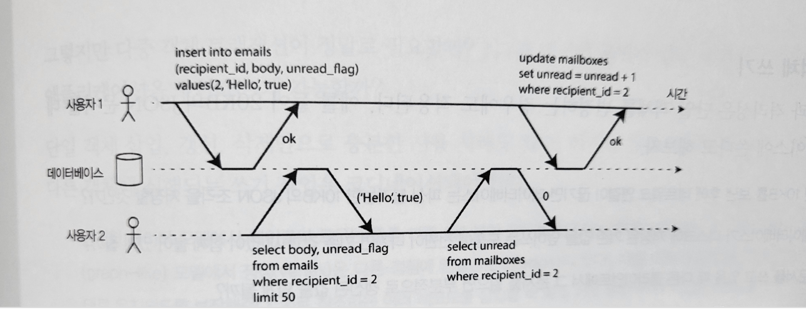
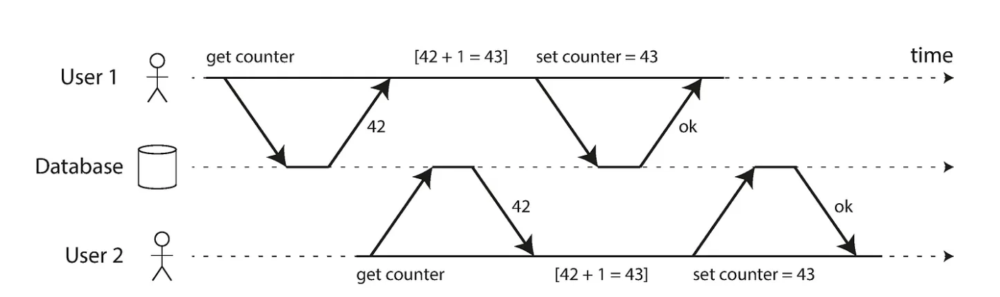

= 트랜잭션

.트랜잭션이란?
* 어플리케이션에서 몇개의 읽기와 쓰기를 하나의 논리적 단위로 묶는 방법
* 전체가 성공(커밋) 하거나, 실패(어보트) 한다

.트랜잭션이 제공하는 안정성
* ACID(원자성/일관선/격리성/지속성)
* 원자성
** 더이상 쪼개지지 않는 것
** 실행되거나 실행되지 않는 상태만 있고 중간 상태는 없음
* 일관성
** 트랜잭션이 실행을 성공적으로 완료하면 언제나 일관성 있는 데이터베이스 상태로 유지하는 것
** ex)회계시스템의 대변과 차변이 맞는 것
** 일관성은 실제로는 ACID에 속하지 않고 애플리케이션의 속성으로 본다
* 격리성
** 동시에 실행되는 트랜잭션은 서로 격리되어 방해할 수 없다.
** 직렬성 격리는 성능 손해를 동반하므로 잘 쓰이지 않음
* 지속성
** 성공적으로 커밋됐다면 하드웨어 결함이 발생하거나 데이터베이스가 죽더라도 트랜잭션에서 기록한 모든 데이터는 손실되지 않는다는 보장
** 지속성을 보장하려면 커밋 전에 복제가 완료되기 까지 기다려야 함.
** 완벽한 지속성은 존재하지 않음

== (완화된) 격리 수준 

트랜잭션 끼리 동시에 같은 데이터를 변경하려고 한다면?
-> 이론상은 트랜잭션끼리 격리되어있기 때문에 영향을 주지 않음
-> 하지만 직렬성 격리는 비용이 큼. 따라서 완화된 격리 수준을 사용
** 일부 동시성 이슈는 해결해 주지만 일부는 해결하지 못함

=== 커밋 후 읽기(READ COMMITTED) 

가장 기본적인 트랜잭션 격리
데이터베이스에서 읽을 때 커밋된 데이터만 보게 된다(더티 읽기가 없음)
데이터베이스에 쓸 때 커밋된 데이터만 덮어쓰게 된다(더티 쓰기가 없음)

.더티 읽기 
* 더티 읽기가 생기면 다른 트랜잭션이 일부는 갱신된 값을, 일부는 갱신되지 않은 값을 볼 수 있다.

 

방지하는 법
* 과거의 커밋된 값/ 현재 쓰고 있는 새로운 값을 모두 기억

.더티 쓰기 
* 나중에 실행된 쓰기 작업이 커밋되지 않은 값을 덮는 경우
* 더티 쓰기가 있으면 내용이 섞일 수 있다

방지하는 법
* 커밋되거나 어보트될 때까지 잠금을 보유
.스냅숏 격리방식
image::img/snapshot.png[] 

읽는쪽에서는 쓰는 쪽을 막지 않으며, 쓰는 쪽에서는 읽는 쪽을 막지 않는다.

=== 갱신 손실 방지 
갱신 손실 : 경쟁 조건에서 한쪽의 갱신이 다른 한쪽의 갱신을 덮어씌워버리는 것

 

방지하는 법
* 원자적 쓰기 연산
[source,sql]
----
UPDATE conters SETR value = value + 1 WHERE key = 'foo';// Db 에서 원자성이 보장되도록 제공 함
----

* 명시적인 잠금
[source,sql]
----
begin transaction

select  * from figures
where name = 'robot' and game_id = 222
for update;
//모든 로우에 대해 잠금획득

update figures set position = 'c4' where id = 4

commit;
----

=== 직렬성 

* 격리 수준은 이해하기 어렵고 데이터베이스마다 그 구현에 일관성이 없음
* 대안은 직렬성 격리 사용
* 직렬성 격리는 보통 가장 강력한 경리 수준이라고 여겨짐

==== 직렬성을 제공하는 방법

* 직렬 실행
** 한 번에 트랜잭션 하나씩만 직렬로 단일 스레드에서 실행하면 됨
** 제약사항
*** 모든 트랜잭션은 작고 빨라야 한다
*** 활성화된 데이터셋이 메모리에 적재될 수 있는 경우로 사용이 제한

* 2단계 잠금
** 트랜잭션 A가 객체 하나를 읽고 트랜잭션 B가 그 객체에 쓰기를 원한다면 B는 진행하기 전에 A가 커밋되거나 어보트될 때까지 기다려야 한다
** 트랜잭션 A가 객체에 썼고 트랜잭션 B가 그 객체를 읽기 원한다면 B는 진행하기 전에 A가 커밋되거나 어보트될 때까지 기다려야 한다
-> 읽는쪽에서도 쓰는 쪽을 막고, 쓰는쪽에서 읽는쪽을 막는다.

.단점
* 잠금이 아주 많이 사용되므로 교착 상태(두 개의 트랜잭션이 서로 기다리는 것)가 매우 쉽게 발생할 수 있음
* 잠금을 획득하고 해제하는 오버헤드가 큼

== 직렬성 스냅숏 격리

완화된 격리수준을 사용하면 성능은 좋지만, 다양한 경쟁조건(갱신손실, 더티리드 등)에 취약하다

직렬성 격리를 사용하면 성능이 좋지않다. 

두가지를 모두 취할 수 는 없을까?

* 직렬성을 제공하지만, 스냅숏 격리에 비해 조금의 성능 손해만 있을 뿐

.비관적 동시성 제어 vs 낙관적 동시성 제어
====
* 2단계 잠금은 비관적 동시성 제어 메커니즘임
** 뭔가 잘못될 가능성이 있으면 뭔가를 하기 전에 상황이 다시 안전해질 때 까지 기다리는게 낫다는 원칙
* 직렬성 스냅숏 격리는 낙관적 동시성 제어 메커니즘
** 트랜잭션을 막는 대신 모든 것이 괜찮아질 거라는 희망을 갖고 계속 진행한다는 뜻
** 커밋되기를 원할 때 데이터베이스는 나쁜 상황이 발생했는지 확인함
** 경쟁이 심하면 abort 비율이 높아지므로 성능 떨어짐
** 트랜잭션 사이의 경쟁이 너무 심하지 않으면, 낙관적 동시성 제어 기법이 성능이 좋음
** 어보트 비율이 전체적인 성능에 큰 영향을 끼침
====

