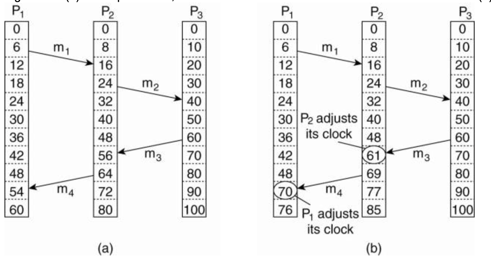
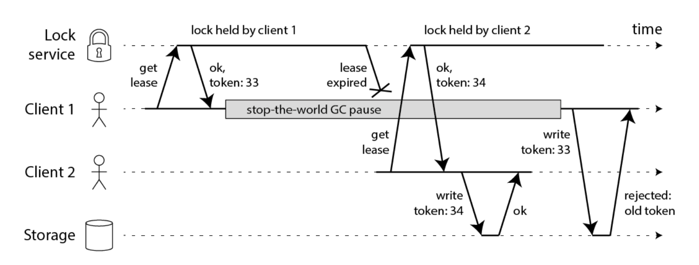

= 분산 시스템의 골치거리

분산 컴퓨팅 환경에서는 단일 컴퓨팅 환경과 다르게 예측할 수 없는 부분에서 고장이 난다.

* 이를 부분장애라고 하고, 부분장애는 비결정적이라서 어렵다.

== 신뢰성 없는 네트워크 

* 분산시스템은 비공유 시스템이다. 즉 네트워크로 연결된 다수의 장비이다.
* 각 노드들은 서로 다른 장비의 메모리나 디스크엔 접근할 수 없다. -> 네트워크가 유일한 통신수단이다

네트워크는 메시지가 도착할 것인지는 보장하지 않음
. 요청 손실(물리적인 이유 포함)
. 요청이 큐에서 대기하다 나중에 전송
. 원격 노드에 장애 발생
. 원격 노드가 일시적으로 응답을 멈췄지만 나중에 다시 응답 시작
. 응답이 네트워크상에서 유실
. 응답이 지연되다가 나중에 전송

응답을 받지 못했다면 그이유를 아는것은 불가능하다. 
-> 이를 다루는 흔한 방법은 Timeout
-> 네트워크 결함이 드물더라도 결함이 일어날 수 있다는 사실은 인지하고 소프트웨어가 이를 처리할 수 있도록 설계 해야 한다

== 타임아웃

. 타임아웃이 길면 노드가 죽었다고 선언될 때까지 기다리는 시간이 길어진다
. 타임아웃이 짧으면 결함을 빨리 발견하지만 응답이 일시적으로 느려졌어도 죽었다고 선언할 가능성
-> 과부하 때문에 응답이 느릴 뿐일 수도 있다. 그 부하를 다른 노드로 전달하면 연쇄 장애를 유발할 수 있다.

== 신뢰성 없는 시계 

분산 환경에서는 통신이 즉각적이지 않으므로 시간을 다루기 까다롭다.
* 메세지를 받은 시간은 항상 보낸 시간보다 나중이지만, 여러 장비가 연관 될 때 일이 발생한 순서를 정확히 알아내기가 어렵다.
* 각 장비는 자신만의 시간 내명이 있으며, 다른 장비보다 약간 차이날 수 있다.
* NTP(Netword Time Protocol) 등으로 시간을 조정한다.

== 램포트 타임스탬프 알고리즘

분산 환경에서 타임스탬프 순서를 제공하는 하나의 방법

 

== 거짓말에 대한 보다 나은 신뢰성 제공

.진실은 다수결로 결정된다
* 정족수, 즉 노드 사이의 투표에 의존한다
* 특정한 노드 하나에 대한 의존을 줄이기 위해 결정을 하려면 여러 노드들로부터 어떤 최소 개수의 투표를 받아야 함

.펜싱토큰
* 잘못된 리더 현상을 막기 위해 사용 / 자신의 펜싱토큰과 비교하여 오래되었다면 처리하지 않음(HBase 에 이러한 문제가 있었다)

 

== 비잔틴 결함 

노드가 거짓말(임의의 결함이 있거나 오염된 응답을 보냄)을 할지도 모른다는 위험이 있다면 훨씬 더 어려워진다

* 일부 노드가 오작동하고 프로토콜을 준수하지 않거나 악의적인 공격자가 네트워크를 방해하더라도 시스템이 계속 올바르게 동작한다면 이 시스템은 비잔틴 내결함성을 지닌다
* 비잔틴 내결함성 솔루션을 배치하는것은 비용이 커서 현실적이지 않음(각 노드가 독립적으로 구현된 다른 솔루션을 사용해야 함, 하나의 노드가 침해될 수 있다면 모든 노드가 침해될 수 있기 때문)
* 현실적으로 모든 노드가 같은 솔루션을 사용하고 있기 때문에 인증, 접근제어, 암호화등으로 공격자로부터 보호

== 정리

* 네트워크 (전송) 패킷은 손실되거나 지연될 수 있다. 응답 패킷도 마찬가지
* 노드의 시계는 다른 노드의 시계와 심하게 맞지 않을 수 있다. (ntp 설정을 하더라도). 시간이 앞뒤로 뛸수도 있다. 시계에 의존하는것은 좋지 않다
* 프로세스는 실행 도중 gc 때문에 (software 뿐만 아니라 hardware 도 마찬가지) 상당시간 멈출 수 있고 죽었다고 선언될 수 있으며 되살아 났을 때 이사실을 알지 못할 수 있다.