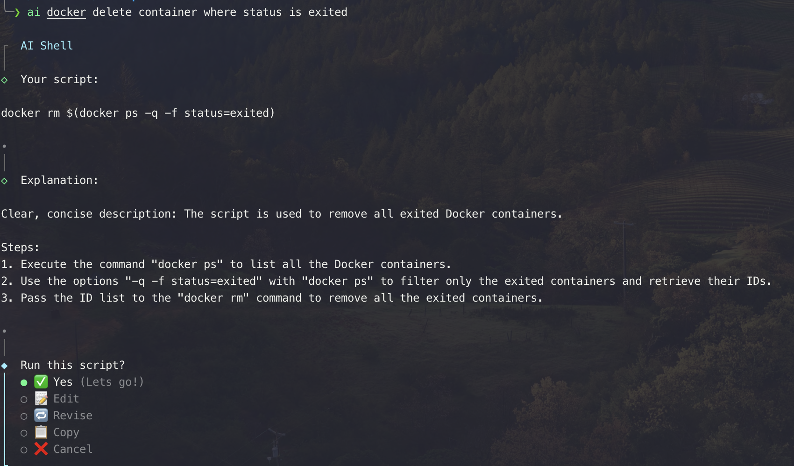

= GPT 사용 방안에 대한 소개자료
:reproducible:
:listing-caption: Source
:hardbreaks:

.ChatGPTers (국내 gpt 사용자 모임)
* https://www.chatgpters.org/c/notice/chatgpt[chat-gpters 모임 중 활용방법 소개글]
* 예제를 중심으로 잘 설명하고 있음 

.GPT 에게 역할을 부여하는 프롬프트 공유 공간
* https://github.com/f/awesome-chatgpt-prompts
** 번외) 잘 만들어진 프롬프트를 서로 사고팔기도 함 : https://promptbase.com/

.개발자를 위한 GPT 사례 및 활용법 소개
* https://www.developerfastlane.com/blog/chatgpt-application-guide-for-developers-part1

.Auto GPT
* Goal 만 지정해주고 gpt 를 활용해서 방향을 알아서 찾아가는 모델이 있음(중간중간 모델이 재질문을 하고 맞는지 틀린지 입력을 해줌)
* https://github.com/Significant-Gravitas/Auto-GPT
** 원래는 cli 기반이나, agent 를 별도로 여러곳에서 개발하였음
** https://evo.ninja

.Ollama
* ai model 을 로컬환경에 다운받아 돌릴 수 있음
* https://ollama.ai/
** local 환경을 외부에 제공할 수 있음

.Uncensored Model 도 .. 가능
 

.Localhost 환경에서 실행하는 예제
[source,sh]
----
$ curl http://localhost:11434/api/generate -d '{ "model": "llama2", "prompt": "How can I make Spaghetti"}'

{"model":"llama2","created_at":"2023-12-18T17:49:57.079768Z","response":"M","done":false}
{"model":"llama2","created_at":"2023-12-18T17:49:57.129675Z","response":"aking","done":false}
{"model":"llama2","created_at":"2023-12-18T17:49:57.178802Z","response":" sp","done":false}
{"model":"llama2","created_at":"2023-12-18T17:49:57.226965Z","response":"agh","done":false}
{"model":"llama2","created_at":"2023-12-18T17:49:57.275316Z","response":"etti","done":false} ....
----

.AI-shell
* 명령어를 기억할 필요가 없음
** https://github.com/BuilderIO/ai-shell

.Asking shell command
 