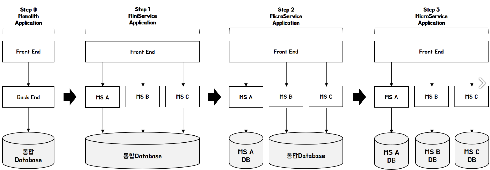
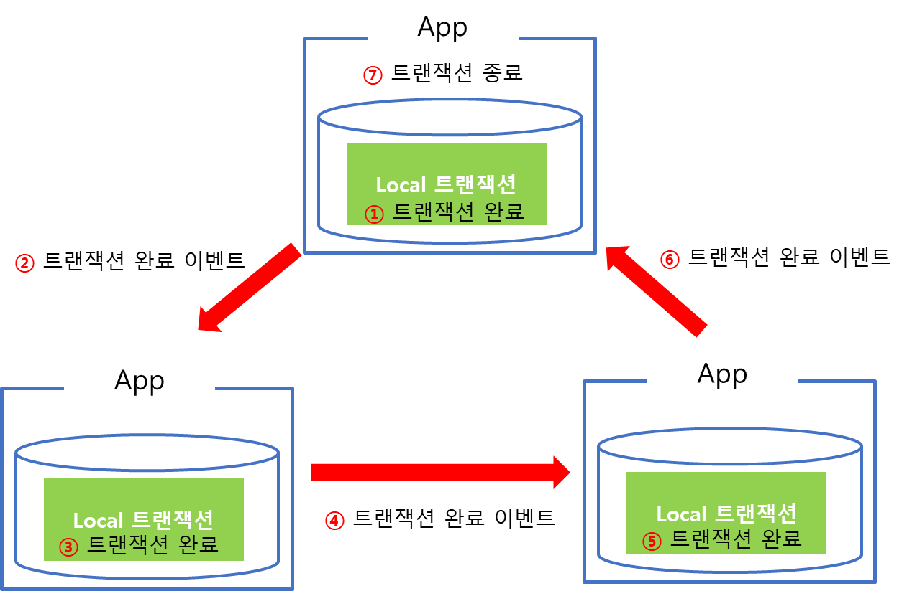
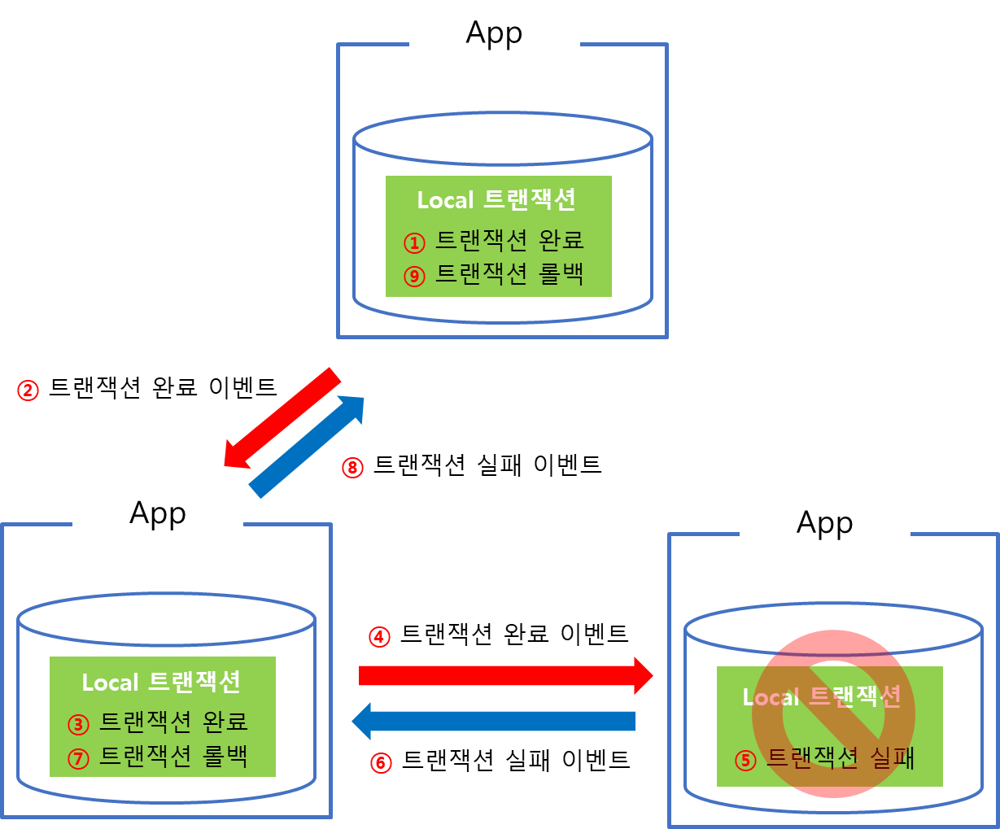
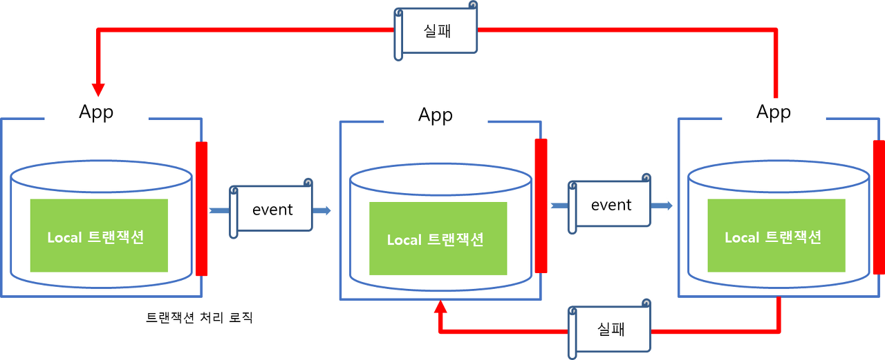
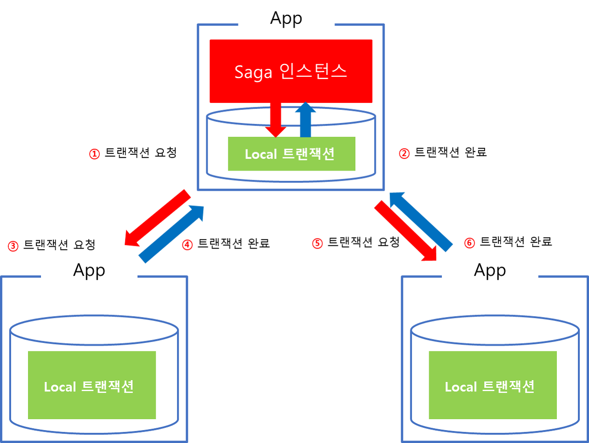

= 마이크로서비스 분산 트랜잭션 관리

MSA 구조에서는 기존 모롤리틱 아키텍쳐와 비교해 DB 를 쪼개서 관리하고 있음

기존구조를 전환한다고 할 때, 보통 리스크를 최소화하며 마이크로서비스로 전환해 나가기위해서는 백엔드 → 데이터베이스(데이터) → 프론트엔드 순으로 점진적인 변화

 

마이크로서비스에서 데이터베이스를 분리하기 위해 분산 트랜잭션은 어떻게 관리되어야 할까?

트랜잭션 : ACID 원자성(Atomicity), 일관성(Consistency), 격리(Isolation) 및 내구성( Durability)

* 원자성이 어떻게 보호?

예를 들어 고객이 탈퇴한다고 했을때
- 고객서비스에서 고객정보 삭제
- 송금서비스에서 고객정보 삭제

위 두가지 행위가 같은 변경이지만, 다른 DB 에서 이루어 짐.

두 서비스에서 동작하는 CUD 동작을 하나의 트랜잭션으로 묶어 처리할 수 있지만
-> 결합도를 낮추는 마이크로서비스를 구현하는 방식과는 맞지 않음

2Phase Commit과 Saga Pattern 등으로 분산되어있는 환경에서 트랜잭션 관리를 해줌

== 2Phase Commit(2PC)

투표 -> 커밋하는 단계

.투표 단계
. Coordinator는 고객서비스의 CUSTID 0001 삭제 요청과 이체서비스의 UserID가 0001인 행 삭제 요청을 보낸다.
. 고객서비스와 이체서비스에서 상태 변경이 가능여부에 대해 투표하고 해당 Row에 lock을 잡는다.
.. 투표 결과 모두 가능하다고 하면 각 서비스에서 상태를 변경하고 다음 단계로 넘어간다.
.. 하나라도 상태 변경이 불가능하다고 투표하면 트랜잭션은 중단된다.

.Commit 단계
. Coordinator는 Commit 메시지를 각 서비스로 전달한다.
. 고객서비스는 CUSTID 0001인 Row를 삭제하고, 이체서비스는 UserID가 0001인 Row를 모두 삭제한다.

2PC는 서비스가 증가할수록 시스템의 대기 시간이 길어지고 응답시간 증가

== Saga Pattern

마이크로서비스들끼리 이벤트를 주고 받아 특정 마이크로서비스에서의 작업이 실패하면 이전까지의 작업이 완료된 마이크서비스들에게 보상(complemetary) 이벤트를 소싱

Saga Pattern 은 여러 서비스에 걸친 트랜잭션을 관리하는 데에도 적합

 

 

* 실패로 인한 Rollback 처리(보상 트랜잭션)은 DB 가 아닌, Application에서 구현
** 트랜잭션 관리를 Application에서 하기 때문에 DBMS를 다른 제품군으로 구성할 수 있음
* 전체 데이터가 동시에 영속화되는 것이 아니라 순차적인 단계로 트랜잭션이 이루어진다

=== Choreography-Based Saga

자신이 보유한 서비스 내 local 트랜잭션을 관리하며, 트랜잭션이 종료되면 완료 이벤트를 발행한다

 

구축하기 비교적 쉽지만 운영자의 입장에서 트랜잭션의 현재 상태를 알기가 어렵다
. 서로의 명령을 소비해야 하기 때문에 Saga 참가자 간에 순환 종속성이 발생할 위험
. 트랜잭션을 시뮬레이션하기 위해 모든 서비스를 실행해야 하므로 통합 테스트가 어렵다 

=== Orchestration-Based Saga

 

트랜잭션 처리를 위한 Saga 인스턴스(Manager)가 별도로 존재

* 트랜젝션에 관여하는 모든 서비스는 중계자에 의해서 점진적으로 트랜잭션을 수행하며 결과를 중계자에게 전달
* 마지막 트랜잭션이 끝나게되면 중계자를 종료하면서 전체 트랜잭션 처리를 종료
* 실패 시 보상 트랜잭션 발행

.장점
. 프로세스의 모든 참가자를 제어하고 활동 흐름을 제어할 수 있는 경우에 적합
. 오케스트레이터는 일방적으로 Saga 참가자에 의존하기 때문에 순환 종속성 X
