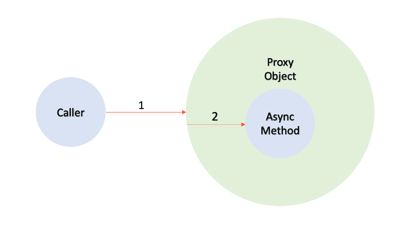

= Spring AOP 이해.. @Async @Transactional 동작 원리

:reproducible:
:listing-caption: Source
:source-highlighter: rouge
:hardbreaks:

== 내용 요약

같은 클래스 내에서 AOP 로 동작하는 어노테이션사용시 주의하자.

== @Transactional

대략 이런 코드를 작성한 적이 있었음

[source,java]
----
@Controller
public MyController{
  @GetMapping()
  public String test(){
    myservice.transaction();
  }
}

@Service
public MyService{
  
  public void transaction(List<String> elements){
    elements.forEach(e->this.delete(e));
  }

  @Transactional
  private void delete(){
    dao.delete();
  }
}
----

현재 코드에서 @Transactional 이 걸리지 않음. 왜그런걸까..??

== Spring AOP 방식

* @Transactional 어노테이션을 선언한 메서드가 실행되기 전 
** transaction begin을 삽입하고
* 메서드 실행 후에 
** Transaction commit 코드를 삽입
** 객체 변경감지를 수행하도록 유도한다.

대략 이런 식
[source,java]
----
public class MyServiceProxy {
  private final MyService myservice;
  private final TransactonManager manager = TransactionManager.getInstance();

  public void delete(String name) {
    try {
      manager.begin();
      myservice.delete(name);
      manager.commit();
    } catch (Exception e) {
      manager.rollback();
    }
  }
}
----

== @Transactional이 수행되지 않은 이유

프록시 객체가 아닌 실제 MyService 객체의 함수를 호출
* `new MyService()` 하거나 Myservice.delete()
하게 되면 Spring의 도움을 받을 수 없으므로 동작할 수 없게 된다.

== 해결 방법

. @Transactional 어노테이션 메서드는 클래스 내부적으로 사용하지 말고, 밖에서 사용.
. 굳이 내부적으로 사용하려면, 자기 자신의 Proxy 객체를 사용하여 처리

== 비슷한 사례 @Async

[source,java]
----
public void asyncCall_1() {
    System.out.println("[asyncCall_1] :: " + Thread.currentThread().getName());
    // async call
    emailService.sendMail(); 
    emailService.sendMailWithCustomThreadPool();
}

public void asyncCall_2() {
    System.out.println("[asyncCall_2] :: " + Thread.currentThread().getName());
    EmailService emailService = new EmailService();
    // not async call
    emailService.sendMail();
    emailService.sendMailWithCustomThreadPool();
}

public void asyncCall_3() {
    System.out.println("[asyncCall_3] :: " + Thread.currentThread().getName());
    // not async call
    this.sendMail();
}

@Async
public void sendMail() {
    System.out.println("[sendMail] :: " + Thread.currentThread().getName());
}
----

== Reference

* https://dzone.com/articles/effective-advice-on-spring-async-part-1
* https://medium.com/engineering-housing/proxy-pattern-and-spring-transactional-931ab6b55eee
* https://goodgid.github.io/SpringBoot-Why-doesn't-it-work-with-Async/
* https://velog.io/@ddongh1122/Spring-Transactional-%ED%81%B4%EB%9E%98%EC%8A%A4-%EB%82%B4%EB%B6%80-%ED%98%B8%EC%B6%9C-%EB%AF%B8%EC%9E%91%EB%8F%99-%EC%9D%B4%EC%8A%88
