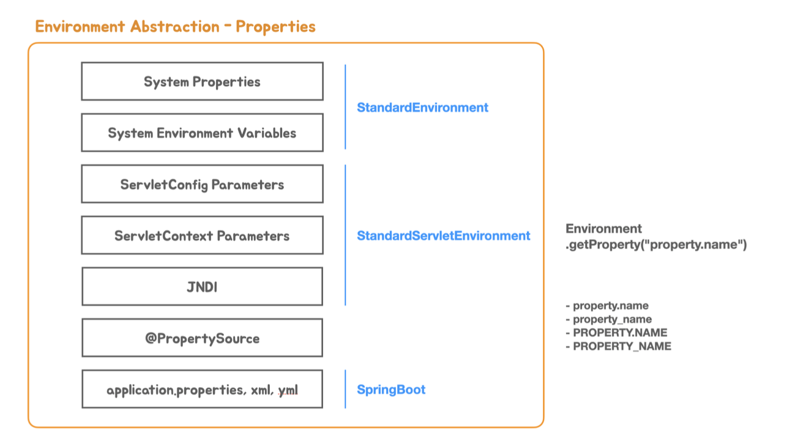

= 스프링부트 Environment 추상화 : profile 과 properties

:reproducible:
:listing-caption: Source
:source-highlighter: rouge
:hardbreaks:

== Environment 추상화

 

* 프로퍼티 정보는 시스템 프로퍼티 환경 변수 서블릿 파라미터 등에서 우선순위에 따라서 가져온다
* 애플리케이션 코드에서로 프로퍼티 값을 가져올 대상을 지정할 수 있다
* 우선순위가 있어서 해당 순서에 따라 우선순위 높은 대상을 가져오게 됨.
* ex) @TestPropertySource > application.properties
* 간단한 테스트
** application Property < Environment Variable < System Property

== @Value 와 PropertySourcesPlaceholderConfigurer

@Value 치환자를 프로퍼티 값으로 교체하려면 PropertySourcesPlaceholderConfigurer
를 빈으로 등록해 줘야 함

* 예제 소스코드 
[source,java]
----
public class ServerProperties {
    @Value("${contextPath}")
    String contextPath;

    @Value("${port}")
    String port;
}
public class PropertyPlaceholderConfig {
    @Bean
    PropertySourcesPlaceholderConfigurer propertySourcesPlaceholderConfigurer() {
        return new PropertySourcesPlaceholderConfigurer();
    }
}
----

* 치환되는 과정은 PropertySourcesPropertyResolver 에 등록되어있음
* 이를 활용하면 프로퍼티를 특정 로직에 따라 치환할 수 있음
** ex) nclavis://{val=1,key=2}

