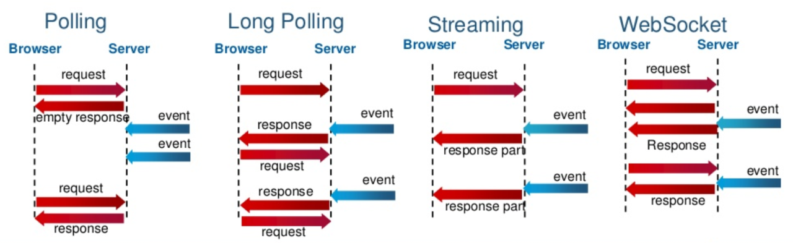

= 웹소켓 101

:listing-caption: Source
:source-highlighter: rouge
:hardbreaks:

웹 소켓(Web Socket)은 하나의 TCP 접속에 전이중 통신 채널을 제공하는 양방향 컴퓨터 통신 프로토콜
* 실시간 채팅, 게임, 주식 거래, 화상 채팅 등 Real-time Web Application 구현
* protocol :  ws (Web Socket), wss (Web Socket Secure)

== 웹소켓 이전

[] 
.Polling
. 서버로 주기적으로 요청을 날려 새로운 이벤트가 있는지 확인
. 실시간 X

.Long Polling
. 이벤트 내용이 있을 때까지 기다렸다가 응답을 보냄
. 이벤트가 많이 발생하여 시간 간격이 좁아지면 폴링과 큰 차이가 없음

.Streaming
. 커넥션을 맺은 후, 이벤트가 발생해도 서버는 이 커넥션을 끊지 않고 계속 flush

-> 모두 HTTP의 단방향 통신 규칙을 변경하지 않고 구현한 방식

== 웹소켓

. 최초 접속은 HTTP 요청을 통해 이루어짐
. ws로 프로토콜을 변환해서 커넥션을 맺음
* Socket 연결을 유지하는 자체가 비용 발생
* 연결이 끊겼을 때에 대한 대응이 필요

== 동작방식

.Request
[source,txt]
----
GET /chat HTTP/1.1
Host: example.com:8000
Upgrade: websocket
Connection: Upgrade
Sec-WebSocket-Key: dGhlIHNhbXBsZSBub25jZQ==
Origin: http://example.com
Sec-WebSocket-Protocol: chat, superchat
Sec-WebSocket-Version: 13
----
* Upgrade: websocket : 다른 프로토콜로 업그레이드 또는 변경하기 위한 규칙
* Connection: Upgrade : 송신자는 반드시 Upgrade 옵션을 지정한 Connection 헤더 필드가 필요
* Sec-WebSocket-Key: 신원 인증시 사용

.Response
[source,sh]
----
HTTP/1.1 101 Switching Protocols
Upgrade: websocket
Connection: Upgrade
Sec-WebSocket-Accept: s3pPLMBiTxaQ9kYGzzhZRbK+xOo=
----
* Sec-WebSocket-Accept:  Sec-WebSocket-Key를 사용하여 계산된 값
** 클라이언트에서 계산한 값과 일치해야 함

== 데모

link:./example/socket.html[]

== 추가 유의점?

* Connection, Upgrade 헤더는 `hop-by-hop headers` 이다
** https://datatracker.ietf.org/doc/html/rfc2616#section-13.5.1
** 중간에 proxy 서버가 있는경우 변경될 수 있다.